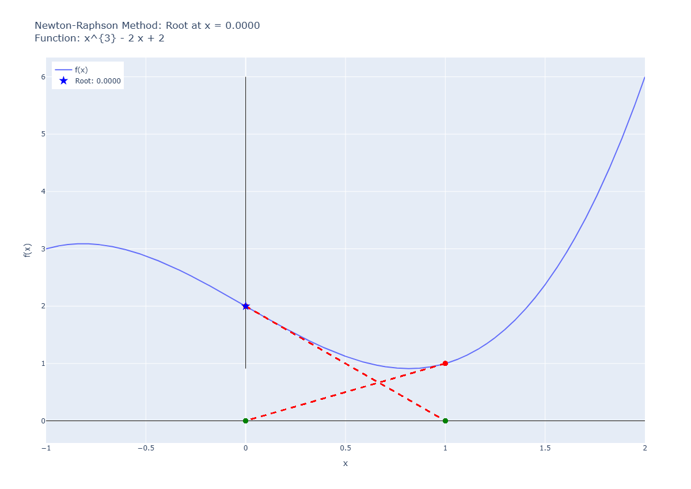
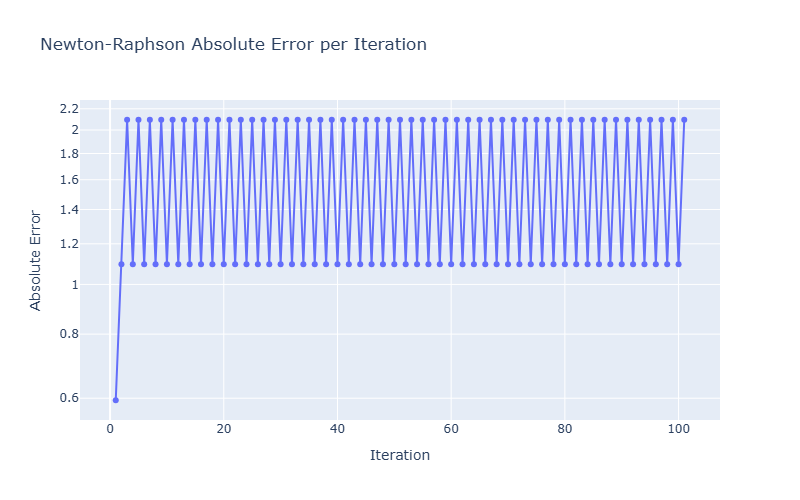

# Pitfall 02: Max and Min Points

## input

```python
runNRM(
    f = "x**3 - 2*x + 2",
    x0 = 1.5,
    know_root= 2.0945514815423265,
    tol=1e-6,
    max_iter=100,
    plotError=True,
    )
```

result:

```plaintext
✗ Não convergiu. Iterações realizadas: 100
Erro: Número máximo de iterações atingido.
Último valor calculado: 0.0000
Iteração 1: x = 1.50000000000000000, f(x) = 2.37500000000000000
Iteração 2: x = 1.00000000000000000, f(x) = 1.00000000000000000
Iteração 3: x = 0.00000000000000000, f(x) = 2.00000000000000000
Iteração 4: x = 1.00000000000000000, f(x) = 1.00000000000000000
Iteração 5: x = 0.00000000000000000, f(x) = 2.00000000000000000
Iteração 6: x = 1.00000000000000000, f(x) = 1.00000000000000000
Iteração 7: x = 0.00000000000000000, f(x) = 2.00000000000000000
Iteração 8: x = 1.00000000000000000, f(x) = 1.00000000000000000
Iteração 9: x = 0.00000000000000000, f(x) = 2.00000000000000000
Iteração 10: x = 1.00000000000000000, f(x) = 1.00000000000000000
Iteração 11: x = 0.00000000000000000, f(x) = 2.00000000000000000
Iteração 12: x = 1.00000000000000000, f(x) = 1.00000000000000000
Iteração 13: x = 0.00000000000000000, f(x) = 2.00000000000000000
Iteração 14: x = 1.00000000000000000, f(x) = 1.00000000000000000
Iteração 15: x = 0.00000000000000000, f(x) = 2.00000000000000000
Iteração 16: x = 1.00000000000000000, f(x) = 1.00000000000000000
Iteração 17: x = 0.00000000000000000, f(x) = 2.00000000000000000
Iteração 18: x = 1.00000000000000000, f(x) = 1.00000000000000000
Iteração 19: x = 0.00000000000000000, f(x) = 2.00000000000000000
Iteração 20: x = 1.00000000000000000, f(x) = 1.00000000000000000
Iteração 21: x = 0.00000000000000000, f(x) = 2.00000000000000000
Iteração 22: x = 1.00000000000000000, f(x) = 1.00000000000000000
Iteração 23: x = 0.00000000000000000, f(x) = 2.00000000000000000
Iteração 24: x = 1.00000000000000000, f(x) = 1.00000000000000000
Iteração 25: x = 0.00000000000000000, f(x) = 2.00000000000000000
Iteração 26: x = 1.00000000000000000, f(x) = 1.00000000000000000
Iteração 27: x = 0.00000000000000000, f(x) = 2.00000000000000000
Iteração 28: x = 1.00000000000000000, f(x) = 1.00000000000000000
Iteração 29: x = 0.00000000000000000, f(x) = 2.00000000000000000
Iteração 30: x = 1.00000000000000000, f(x) = 1.00000000000000000
Iteração 31: x = 0.00000000000000000, f(x) = 2.00000000000000000
Iteração 32: x = 1.00000000000000000, f(x) = 1.00000000000000000
Iteração 33: x = 0.00000000000000000, f(x) = 2.00000000000000000
Iteração 34: x = 1.00000000000000000, f(x) = 1.00000000000000000
Iteração 35: x = 0.00000000000000000, f(x) = 2.00000000000000000
Iteração 36: x = 1.00000000000000000, f(x) = 1.00000000000000000
Iteração 37: x = 0.00000000000000000, f(x) = 2.00000000000000000
Iteração 38: x = 1.00000000000000000, f(x) = 1.00000000000000000
Iteração 39: x = 0.00000000000000000, f(x) = 2.00000000000000000
Iteração 40: x = 1.00000000000000000, f(x) = 1.00000000000000000
Iteração 41: x = 0.00000000000000000, f(x) = 2.00000000000000000
Iteração 42: x = 1.00000000000000000, f(x) = 1.00000000000000000
Iteração 43: x = 0.00000000000000000, f(x) = 2.00000000000000000
Iteração 44: x = 1.00000000000000000, f(x) = 1.00000000000000000
Iteração 45: x = 0.00000000000000000, f(x) = 2.00000000000000000
Iteração 46: x = 1.00000000000000000, f(x) = 1.00000000000000000
Iteração 47: x = 0.00000000000000000, f(x) = 2.00000000000000000
Iteração 48: x = 1.00000000000000000, f(x) = 1.00000000000000000
Iteração 49: x = 0.00000000000000000, f(x) = 2.00000000000000000
Iteração 50: x = 1.00000000000000000, f(x) = 1.00000000000000000
Iteração 51: x = 0.00000000000000000, f(x) = 2.00000000000000000
Iteração 52: x = 1.00000000000000000, f(x) = 1.00000000000000000
Iteração 53: x = 0.00000000000000000, f(x) = 2.00000000000000000
Iteração 54: x = 1.00000000000000000, f(x) = 1.00000000000000000
Iteração 55: x = 0.00000000000000000, f(x) = 2.00000000000000000
Iteração 56: x = 1.00000000000000000, f(x) = 1.00000000000000000
Iteração 57: x = 0.00000000000000000, f(x) = 2.00000000000000000
Iteração 58: x = 1.00000000000000000, f(x) = 1.00000000000000000
Iteração 59: x = 0.00000000000000000, f(x) = 2.00000000000000000
Iteração 60: x = 1.00000000000000000, f(x) = 1.00000000000000000
Iteração 61: x = 0.00000000000000000, f(x) = 2.00000000000000000
Iteração 62: x = 1.00000000000000000, f(x) = 1.00000000000000000
Iteração 63: x = 0.00000000000000000, f(x) = 2.00000000000000000
Iteração 64: x = 1.00000000000000000, f(x) = 1.00000000000000000
Iteração 65: x = 0.00000000000000000, f(x) = 2.00000000000000000
Iteração 66: x = 1.00000000000000000, f(x) = 1.00000000000000000
Iteração 67: x = 0.00000000000000000, f(x) = 2.00000000000000000
Iteração 68: x = 1.00000000000000000, f(x) = 1.00000000000000000
Iteração 69: x = 0.00000000000000000, f(x) = 2.00000000000000000
Iteração 70: x = 1.00000000000000000, f(x) = 1.00000000000000000
Iteração 71: x = 0.00000000000000000, f(x) = 2.00000000000000000
Iteração 72: x = 1.00000000000000000, f(x) = 1.00000000000000000
Iteração 73: x = 0.00000000000000000, f(x) = 2.00000000000000000
Iteração 74: x = 1.00000000000000000, f(x) = 1.00000000000000000
Iteração 75: x = 0.00000000000000000, f(x) = 2.00000000000000000
Iteração 76: x = 1.00000000000000000, f(x) = 1.00000000000000000
Iteração 77: x = 0.00000000000000000, f(x) = 2.00000000000000000
Iteração 78: x = 1.00000000000000000, f(x) = 1.00000000000000000
Iteração 79: x = 0.00000000000000000, f(x) = 2.00000000000000000
Iteração 80: x = 1.00000000000000000, f(x) = 1.00000000000000000
Iteração 81: x = 0.00000000000000000, f(x) = 2.00000000000000000
Iteração 82: x = 1.00000000000000000, f(x) = 1.00000000000000000
Iteração 83: x = 0.00000000000000000, f(x) = 2.00000000000000000
Iteração 84: x = 1.00000000000000000, f(x) = 1.00000000000000000
Iteração 85: x = 0.00000000000000000, f(x) = 2.00000000000000000
Iteração 86: x = 1.00000000000000000, f(x) = 1.00000000000000000
Iteração 87: x = 0.00000000000000000, f(x) = 2.00000000000000000
Iteração 88: x = 1.00000000000000000, f(x) = 1.00000000000000000
Iteração 89: x = 0.00000000000000000, f(x) = 2.00000000000000000
Iteração 90: x = 1.00000000000000000, f(x) = 1.00000000000000000
Iteração 91: x = 0.00000000000000000, f(x) = 2.00000000000000000
Iteração 92: x = 1.00000000000000000, f(x) = 1.00000000000000000
Iteração 93: x = 0.00000000000000000, f(x) = 2.00000000000000000
Iteração 94: x = 1.00000000000000000, f(x) = 1.00000000000000000
Iteração 95: x = 0.00000000000000000, f(x) = 2.00000000000000000
Iteração 96: x = 1.00000000000000000, f(x) = 1.00000000000000000
Iteração 97: x = 0.00000000000000000, f(x) = 2.00000000000000000
Iteração 98: x = 1.00000000000000000, f(x) = 1.00000000000000000
Iteração 99: x = 0.00000000000000000, f(x) = 2.00000000000000000
Iteração 100: x = 1.00000000000000000, f(x) = 1.00000000000000000
Iteração 101: x = 0.00000000000000000, f(x) = 2.00000000000000000

Erros Absolutos:
Iteração 1: Erro = 0.59455148154232651
Iteração 2: Erro = 1.09455148154232651
Iteração 3: Erro = 2.09455148154232651
Iteração 4: Erro = 1.09455148154232651
Iteração 5: Erro = 2.09455148154232651
Iteração 6: Erro = 1.09455148154232651
Iteração 7: Erro = 2.09455148154232651
Iteração 8: Erro = 1.09455148154232651
Iteração 9: Erro = 2.09455148154232651
Iteração 10: Erro = 1.09455148154232651
Iteração 11: Erro = 2.09455148154232651
Iteração 12: Erro = 1.09455148154232651
Iteração 13: Erro = 2.09455148154232651
Iteração 14: Erro = 1.09455148154232651
Iteração 15: Erro = 2.09455148154232651
Iteração 16: Erro = 1.09455148154232651
Iteração 17: Erro = 2.09455148154232651
Iteração 18: Erro = 1.09455148154232651
Iteração 19: Erro = 2.09455148154232651
Iteração 20: Erro = 1.09455148154232651
Iteração 21: Erro = 2.09455148154232651
Iteração 22: Erro = 1.09455148154232651
Iteração 23: Erro = 2.09455148154232651
Iteração 24: Erro = 1.09455148154232651
Iteração 25: Erro = 2.09455148154232651
Iteração 26: Erro = 1.09455148154232651
Iteração 27: Erro = 2.09455148154232651
Iteração 28: Erro = 1.09455148154232651
Iteração 29: Erro = 2.09455148154232651
Iteração 30: Erro = 1.09455148154232651
Iteração 31: Erro = 2.09455148154232651
Iteração 32: Erro = 1.09455148154232651
Iteração 33: Erro = 2.09455148154232651
Iteração 34: Erro = 1.09455148154232651
Iteração 35: Erro = 2.09455148154232651
Iteração 36: Erro = 1.09455148154232651
Iteração 37: Erro = 2.09455148154232651
Iteração 38: Erro = 1.09455148154232651
Iteração 39: Erro = 2.09455148154232651
Iteração 40: Erro = 1.09455148154232651
Iteração 41: Erro = 2.09455148154232651
Iteração 42: Erro = 1.09455148154232651
Iteração 43: Erro = 2.09455148154232651
Iteração 44: Erro = 1.09455148154232651
Iteração 45: Erro = 2.09455148154232651
Iteração 46: Erro = 1.09455148154232651
Iteração 47: Erro = 2.09455148154232651
Iteração 48: Erro = 1.09455148154232651
Iteração 49: Erro = 2.09455148154232651
Iteração 50: Erro = 1.09455148154232651
Iteração 51: Erro = 2.09455148154232651
Iteração 52: Erro = 1.09455148154232651
Iteração 53: Erro = 2.09455148154232651
Iteração 54: Erro = 1.09455148154232651
Iteração 55: Erro = 2.09455148154232651
Iteração 56: Erro = 1.09455148154232651
Iteração 57: Erro = 2.09455148154232651
Iteração 58: Erro = 1.09455148154232651
Iteração 59: Erro = 2.09455148154232651
Iteração 60: Erro = 1.09455148154232651
Iteração 61: Erro = 2.09455148154232651
Iteração 62: Erro = 1.09455148154232651
Iteração 63: Erro = 2.09455148154232651
Iteração 64: Erro = 1.09455148154232651
Iteração 65: Erro = 2.09455148154232651
Iteração 66: Erro = 1.09455148154232651
Iteração 67: Erro = 2.09455148154232651
Iteração 68: Erro = 1.09455148154232651
Iteração 69: Erro = 2.09455148154232651
Iteração 70: Erro = 1.09455148154232651
Iteração 71: Erro = 2.09455148154232651
Iteração 72: Erro = 1.09455148154232651
Iteração 73: Erro = 2.09455148154232651
Iteração 74: Erro = 1.09455148154232651
Iteração 75: Erro = 2.09455148154232651
Iteração 76: Erro = 1.09455148154232651
Iteração 77: Erro = 2.09455148154232651
Iteração 78: Erro = 1.09455148154232651
Iteração 79: Erro = 2.09455148154232651
Iteração 80: Erro = 1.09455148154232651
Iteração 81: Erro = 2.09455148154232651
Iteração 82: Erro = 1.09455148154232651
Iteração 83: Erro = 2.09455148154232651
Iteração 84: Erro = 1.09455148154232651
Iteração 85: Erro = 2.09455148154232651
Iteração 86: Erro = 1.09455148154232651
Iteração 87: Erro = 2.09455148154232651
Iteração 88: Erro = 1.09455148154232651
Iteração 89: Erro = 2.09455148154232651
Iteração 90: Erro = 1.09455148154232651
Iteração 91: Erro = 2.09455148154232651
Iteração 92: Erro = 1.09455148154232651
Iteração 93: Erro = 2.09455148154232651
Iteração 94: Erro = 1.09455148154232651
Iteração 95: Erro = 2.09455148154232651
Iteração 96: Erro = 1.09455148154232651
Iteração 97: Erro = 2.09455148154232651
Iteração 98: Erro = 1.09455148154232651
Iteração 99: Erro = 2.09455148154232651
Iteração 100: Erro = 1.09455148154232651
Iteração 101: Erro = 2.09455148154232651
```

## graph




## observations

The presence of local maxima and minima can lead to divergence or oscillation around these points, preventing convergence to the actual root. In this case, the method oscillates between two points (1 and 0), failing to converge to the root.
