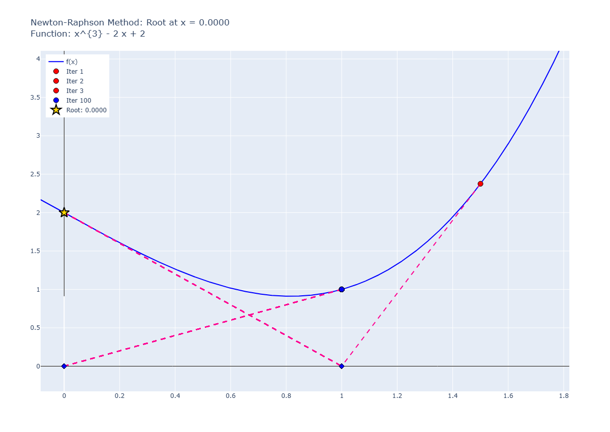

# Pitfall 05: Max and Min Points

## input:

```python
runNRM(
    f = "x**3 - 2*x + 2",
    x0 = 1.5,
    know_root= 2.0945514815423265,
    tol=1e-6,
    max_iter=100
)
```

result:

```plaintext
✗ Não convergiu. Iterações realizadas: 100
Erro: Número máximo de iterações atingido.
Último valor calculado: 0.0000
Iteração 1: x = 1.00000000000000000, f(x) = 1.00000000000000000
Iteração 2: x = 0.00000000000000000, f(x) = 2.00000000000000000
Iteração 3: x = 1.00000000000000000, f(x) = 1.00000000000000000
Iteração 4: x = 0.00000000000000000, f(x) = 2.00000000000000000
Iteração 5: x = 1.00000000000000000, f(x) = 1.00000000000000000
Iteração 6: x = 0.00000000000000000, f(x) = 2.00000000000000000
Iteração 7: x = 1.00000000000000000, f(x) = 1.00000000000000000
Iteração 8: x = 0.00000000000000000, f(x) = 2.00000000000000000
Iteração 9: x = 1.00000000000000000, f(x) = 1.00000000000000000
Iteração 10: x = 0.00000000000000000, f(x) = 2.00000000000000000
Iteração 11: x = 1.00000000000000000, f(x) = 1.00000000000000000
Iteração 12: x = 0.00000000000000000, f(x) = 2.00000000000000000
Iteração 13: x = 1.00000000000000000, f(x) = 1.00000000000000000
Iteração 14: x = 0.00000000000000000, f(x) = 2.00000000000000000
Iteração 15: x = 1.00000000000000000, f(x) = 1.00000000000000000
Iteração 16: x = 0.00000000000000000, f(x) = 2.00000000000000000
Iteração 17: x = 1.00000000000000000, f(x) = 1.00000000000000000
Iteração 18: x = 0.00000000000000000, f(x) = 2.00000000000000000
Iteração 19: x = 1.00000000000000000, f(x) = 1.00000000000000000
Iteração 20: x = 0.00000000000000000, f(x) = 2.00000000000000000
Iteração 21: x = 1.00000000000000000, f(x) = 1.00000000000000000
Iteração 22: x = 0.00000000000000000, f(x) = 2.00000000000000000
Iteração 23: x = 1.00000000000000000, f(x) = 1.00000000000000000
Iteração 24: x = 0.00000000000000000, f(x) = 2.00000000000000000
Iteração 25: x = 1.00000000000000000, f(x) = 1.00000000000000000
Iteração 26: x = 0.00000000000000000, f(x) = 2.00000000000000000
Iteração 27: x = 1.00000000000000000, f(x) = 1.00000000000000000
Iteração 28: x = 0.00000000000000000, f(x) = 2.00000000000000000
Iteração 29: x = 1.00000000000000000, f(x) = 1.00000000000000000
Iteração 30: x = 0.00000000000000000, f(x) = 2.00000000000000000
Iteração 31: x = 1.00000000000000000, f(x) = 1.00000000000000000
Iteração 32: x = 0.00000000000000000, f(x) = 2.00000000000000000
Iteração 33: x = 1.00000000000000000, f(x) = 1.00000000000000000
Iteração 34: x = 0.00000000000000000, f(x) = 2.00000000000000000
Iteração 35: x = 1.00000000000000000, f(x) = 1.00000000000000000
Iteração 36: x = 0.00000000000000000, f(x) = 2.00000000000000000
Iteração 37: x = 1.00000000000000000, f(x) = 1.00000000000000000
Iteração 38: x = 0.00000000000000000, f(x) = 2.00000000000000000
Iteração 39: x = 1.00000000000000000, f(x) = 1.00000000000000000
Iteração 40: x = 0.00000000000000000, f(x) = 2.00000000000000000
Iteração 41: x = 1.00000000000000000, f(x) = 1.00000000000000000
Iteração 42: x = 0.00000000000000000, f(x) = 2.00000000000000000
Iteração 43: x = 1.00000000000000000, f(x) = 1.00000000000000000
Iteração 44: x = 0.00000000000000000, f(x) = 2.00000000000000000
Iteração 45: x = 1.00000000000000000, f(x) = 1.00000000000000000
Iteração 46: x = 0.00000000000000000, f(x) = 2.00000000000000000
Iteração 47: x = 1.00000000000000000, f(x) = 1.00000000000000000
Iteração 48: x = 0.00000000000000000, f(x) = 2.00000000000000000
Iteração 49: x = 1.00000000000000000, f(x) = 1.00000000000000000
Iteração 50: x = 0.00000000000000000, f(x) = 2.00000000000000000
Iteração 51: x = 1.00000000000000000, f(x) = 1.00000000000000000
Iteração 52: x = 0.00000000000000000, f(x) = 2.00000000000000000
Iteração 53: x = 1.00000000000000000, f(x) = 1.00000000000000000
Iteração 54: x = 0.00000000000000000, f(x) = 2.00000000000000000
Iteração 55: x = 1.00000000000000000, f(x) = 1.00000000000000000
Iteração 56: x = 0.00000000000000000, f(x) = 2.00000000000000000
Iteração 57: x = 1.00000000000000000, f(x) = 1.00000000000000000
Iteração 58: x = 0.00000000000000000, f(x) = 2.00000000000000000
Iteração 59: x = 1.00000000000000000, f(x) = 1.00000000000000000
Iteração 60: x = 0.00000000000000000, f(x) = 2.00000000000000000
Iteração 61: x = 1.00000000000000000, f(x) = 1.00000000000000000
Iteração 62: x = 0.00000000000000000, f(x) = 2.00000000000000000
Iteração 63: x = 1.00000000000000000, f(x) = 1.00000000000000000
Iteração 64: x = 0.00000000000000000, f(x) = 2.00000000000000000
Iteração 65: x = 1.00000000000000000, f(x) = 1.00000000000000000
Iteração 66: x = 0.00000000000000000, f(x) = 2.00000000000000000
Iteração 67: x = 1.00000000000000000, f(x) = 1.00000000000000000
Iteração 68: x = 0.00000000000000000, f(x) = 2.00000000000000000
Iteração 69: x = 1.00000000000000000, f(x) = 1.00000000000000000
Iteração 70: x = 0.00000000000000000, f(x) = 2.00000000000000000
Iteração 71: x = 1.00000000000000000, f(x) = 1.00000000000000000
Iteração 72: x = 0.00000000000000000, f(x) = 2.00000000000000000
Iteração 73: x = 1.00000000000000000, f(x) = 1.00000000000000000
Iteração 74: x = 0.00000000000000000, f(x) = 2.00000000000000000
Iteração 75: x = 1.00000000000000000, f(x) = 1.00000000000000000
Iteração 76: x = 0.00000000000000000, f(x) = 2.00000000000000000
Iteração 77: x = 1.00000000000000000, f(x) = 1.00000000000000000
Iteração 78: x = 0.00000000000000000, f(x) = 2.00000000000000000
Iteração 79: x = 1.00000000000000000, f(x) = 1.00000000000000000
Iteração 80: x = 0.00000000000000000, f(x) = 2.00000000000000000
Iteração 81: x = 1.00000000000000000, f(x) = 1.00000000000000000
Iteração 82: x = 0.00000000000000000, f(x) = 2.00000000000000000
Iteração 83: x = 1.00000000000000000, f(x) = 1.00000000000000000
Iteração 84: x = 0.00000000000000000, f(x) = 2.00000000000000000
Iteração 85: x = 1.00000000000000000, f(x) = 1.00000000000000000
Iteração 86: x = 0.00000000000000000, f(x) = 2.00000000000000000
Iteração 87: x = 1.00000000000000000, f(x) = 1.00000000000000000
Iteração 88: x = 0.00000000000000000, f(x) = 2.00000000000000000
Iteração 89: x = 1.00000000000000000, f(x) = 1.00000000000000000
Iteração 90: x = 0.00000000000000000, f(x) = 2.00000000000000000
Iteração 91: x = 1.00000000000000000, f(x) = 1.00000000000000000
Iteração 92: x = 0.00000000000000000, f(x) = 2.00000000000000000
Iteração 93: x = 1.00000000000000000, f(x) = 1.00000000000000000
Iteração 94: x = 0.00000000000000000, f(x) = 2.00000000000000000
Iteração 95: x = 1.00000000000000000, f(x) = 1.00000000000000000
Iteração 96: x = 0.00000000000000000, f(x) = 2.00000000000000000
Iteração 97: x = 1.00000000000000000, f(x) = 1.00000000000000000
Iteração 98: x = 0.00000000000000000, f(x) = 2.00000000000000000
Iteração 99: x = 1.00000000000000000, f(x) = 1.00000000000000000
Iteração 100: x = 0.00000000000000000, f(x) = 2.00000000000000000

Erros Absolutos:
Iteração 1: Erro = 1.09455148154232651
Iteração 2: Erro = 2.09455148154232651
Iteração 3: Erro = 1.09455148154232651
Iteração 4: Erro = 2.09455148154232651
Iteração 5: Erro = 1.09455148154232651
Iteração 6: Erro = 2.09455148154232651
Iteração 7: Erro = 1.09455148154232651
Iteração 8: Erro = 2.09455148154232651
Iteração 9: Erro = 1.09455148154232651
Iteração 10: Erro = 2.09455148154232651
Iteração 11: Erro = 1.09455148154232651
Iteração 12: Erro = 2.09455148154232651
Iteração 13: Erro = 1.09455148154232651
Iteração 14: Erro = 2.09455148154232651
Iteração 15: Erro = 1.09455148154232651
Iteração 16: Erro = 2.09455148154232651
Iteração 17: Erro = 1.09455148154232651
Iteração 18: Erro = 2.09455148154232651
Iteração 19: Erro = 1.09455148154232651
Iteração 20: Erro = 2.09455148154232651
Iteração 21: Erro = 1.09455148154232651
Iteração 22: Erro = 2.09455148154232651
Iteração 23: Erro = 1.09455148154232651
Iteração 24: Erro = 2.09455148154232651
Iteração 25: Erro = 1.09455148154232651
Iteração 26: Erro = 2.09455148154232651
Iteração 27: Erro = 1.09455148154232651
Iteração 28: Erro = 2.09455148154232651
Iteração 29: Erro = 1.09455148154232651
Iteração 30: Erro = 2.09455148154232651
Iteração 31: Erro = 1.09455148154232651
Iteração 32: Erro = 2.09455148154232651
Iteração 33: Erro = 1.09455148154232651
Iteração 34: Erro = 2.09455148154232651
Iteração 35: Erro = 1.09455148154232651
Iteração 36: Erro = 2.09455148154232651
Iteração 37: Erro = 1.09455148154232651
Iteração 38: Erro = 2.09455148154232651
Iteração 39: Erro = 1.09455148154232651
Iteração 40: Erro = 2.09455148154232651
Iteração 41: Erro = 1.09455148154232651
Iteração 42: Erro = 2.09455148154232651
Iteração 43: Erro = 1.09455148154232651
Iteração 44: Erro = 2.09455148154232651
Iteração 45: Erro = 1.09455148154232651
Iteração 46: Erro = 2.09455148154232651
Iteração 47: Erro = 1.09455148154232651
Iteração 48: Erro = 2.09455148154232651
Iteração 49: Erro = 1.09455148154232651
Iteração 50: Erro = 2.09455148154232651
Iteração 51: Erro = 1.09455148154232651
Iteração 52: Erro = 2.09455148154232651
Iteração 53: Erro = 1.09455148154232651
Iteração 54: Erro = 2.09455148154232651
Iteração 55: Erro = 1.09455148154232651
Iteração 56: Erro = 2.09455148154232651
Iteração 57: Erro = 1.09455148154232651
Iteração 58: Erro = 2.09455148154232651
Iteração 59: Erro = 1.09455148154232651
Iteração 60: Erro = 2.09455148154232651
Iteração 61: Erro = 1.09455148154232651
Iteração 62: Erro = 2.09455148154232651
Iteração 63: Erro = 1.09455148154232651
Iteração 64: Erro = 2.09455148154232651
Iteração 65: Erro = 1.09455148154232651
Iteração 66: Erro = 2.09455148154232651
Iteração 67: Erro = 1.09455148154232651
Iteração 68: Erro = 2.09455148154232651
Iteração 69: Erro = 1.09455148154232651
Iteração 70: Erro = 2.09455148154232651
Iteração 71: Erro = 1.09455148154232651
Iteração 72: Erro = 2.09455148154232651
Iteração 73: Erro = 1.09455148154232651
Iteração 74: Erro = 2.09455148154232651
Iteração 75: Erro = 1.09455148154232651
Iteração 76: Erro = 2.09455148154232651
Iteração 77: Erro = 1.09455148154232651
Iteração 78: Erro = 2.09455148154232651
Iteração 79: Erro = 1.09455148154232651
Iteração 80: Erro = 2.09455148154232651
Iteração 81: Erro = 1.09455148154232651
Iteração 82: Erro = 2.09455148154232651
Iteração 83: Erro = 1.09455148154232651
Iteração 84: Erro = 2.09455148154232651
Iteração 85: Erro = 1.09455148154232651
Iteração 86: Erro = 2.09455148154232651
Iteração 87: Erro = 1.09455148154232651
Iteração 88: Erro = 2.09455148154232651
Iteração 89: Erro = 1.09455148154232651
Iteração 90: Erro = 2.09455148154232651
Iteração 91: Erro = 1.09455148154232651
Iteração 92: Erro = 2.09455148154232651
Iteração 93: Erro = 1.09455148154232651
Iteração 94: Erro = 2.09455148154232651
Iteração 95: Erro = 1.09455148154232651
Iteração 96: Erro = 2.09455148154232651
Iteração 97: Erro = 1.09455148154232651
Iteração 98: Erro = 2.09455148154232651
Iteração 99: Erro = 1.09455148154232651
Iteração 100: Erro = 2.09455148154232651
```

## graph:
