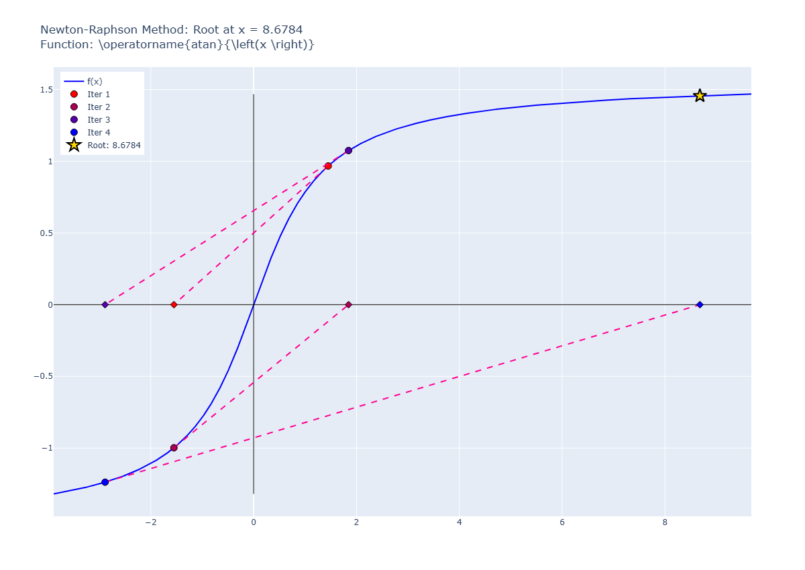
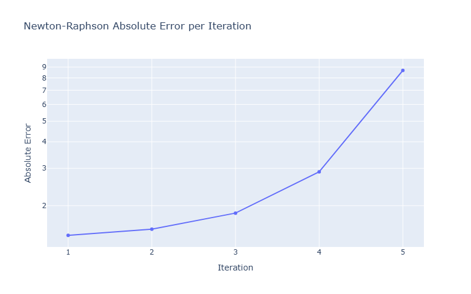

# Pitfall 03: Max and Min Points

## input

```python
runNRM(
    f="atan(x)",
    x0=1.45,
    know_root=0,
    tol=1e-6,
    max_iter=4,
    xLimit=None,
    yLimit=None,
    showTitle=True,
    plotError=True
)
```

result:

```plaintext
✗ Não convergiu. Iterações realizadas: 4
Erro: Número máximo de iterações atingido.
Último valor calculado: 8.6784
Iteração 1: x = 1.44999999999999996, f(x) = 0.96704699339746025
Iteração 2: x = -1.55026329701562049, f(x) = -0.99790755802460773
Iteração 3: x = 1.84593175119723552, f(x) = 1.07432318743154331
Iteração 4: x = -2.88910905408613594, f(x) = -1.23757558204700402
Iteração 5: x = 8.67844942653632145, f(x) = 1.45607432393228908

Erros Absolutos:
Iteração 1: Erro = 1.44999999999999996
Iteração 2: Erro = 1.55026329701562049
Iteração 3: Erro = 1.84593175119723552
Iteração 4: Erro = 2.88910905408613594
Iteração 5: Erro = 8.67844942653632145
```

## graph




### observations

In function with inflection points on the vicinity of a root, Newton's method may oscillate or diverge, as seen here. Notice that the iterations progressively move away from the root.
