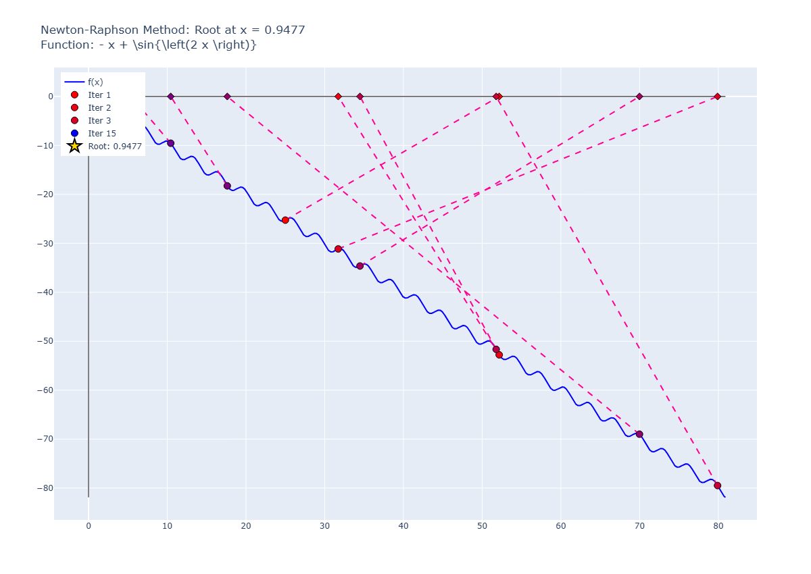
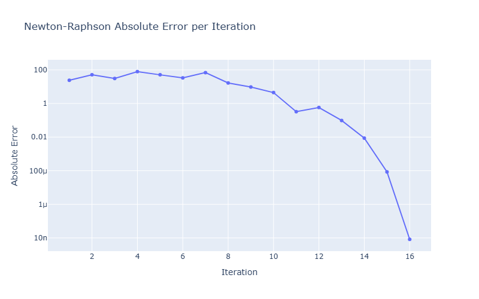

# Pitfall 04: Max and Min Points

## input

```python
runNRM(
    f = "sin(2*x) - x",
    x0 = 25,
    know_root=0.94774713351699058,
    tol=1e-6,
    max_iter=15,
    plotError=True
    )
```

result:

```plaintext
✗ Não convergiu. Iterações realizadas: 15
Erro: Número máximo de iterações atingido.
Último valor calculado: 0.9477
Iteração 1: x = 25.00000000000000000, f(x) = -25.26237485370392832
Iteração 2: x = 52.16582858282131951, f(x) = -52.77823387512278686
Iteração 3: x = 31.71777126176566597, f(x) = -31.15008760232964491
Iteração 4: x = 79.90090781702912182, f(x) = -79.49368643227656150
Iteração 5: x = 51.77806476785846712, f(x) = -51.66189959666515819
Iteração 6: x = 34.47935568423210384, f(x) = -34.63504674889668422
Iteração 7: x = 69.98021173104879722, f(x) = -68.99291291439081419
Iteração 8: x = 17.62355448579880601, f(x) = -18.25977523555878790
Iteração 9: x = 10.44318731356559482, f(x) = -9.54982467298074589
Iteração 10: x = 5.41345035095846594, f(x) = -6.39925865669175309
Iteração 11: x = 0.62268894404425179, f(x) = 0.32482808825663678
Iteração 12: x = 1.52351429605588651, f(x) = -1.42909110924945737
Iteração 13: x = 1.04572747308561098, f(x) = -0.17823573649186741
Iteração 14: x = 0.95638191595725841, f(x) = -0.01428521230377788
Iteração 15: x = 0.94783139178224363, f(x) = -0.00013803229089726
Iteração 16: x = 0.94774714173034480, f(x) = -0.00000001345384448

Erros Absolutos:
Iteração 1: Erro = 24.05225286648300909
Iteração 2: Erro = 51.21808144930432860
Iteração 3: Erro = 30.77002412824867505
Iteração 4: Erro = 78.95316068351213801
Iteração 5: Erro = 50.83031763434147621
Iteração 6: Erro = 33.53160855071511293
Iteração 7: Erro = 69.03246459753181341
Iteração 8: Erro = 16.67580735228181510
Iteração 9: Erro = 9.49544018004860391
Iteração 10: Erro = 4.46570321744147503
Iteração 11: Erro = 0.32505818947273879
Iteração 12: Erro = 0.57576716253889593
Iteração 13: Erro = 0.09798033956862040
Iteração 14: Erro = 0.00863478244026783
Iteração 15: Erro = 0.00008425826525305
Iteração 16: Erro = 0.00000000821335422
```

## graph




## observations

The oscillation of the function around the root can lead to slow convergence or divergence in some cases. The oscillation can cause the method to overshoot or undershoot the root, leading to larger errors in subsequent iterations.
