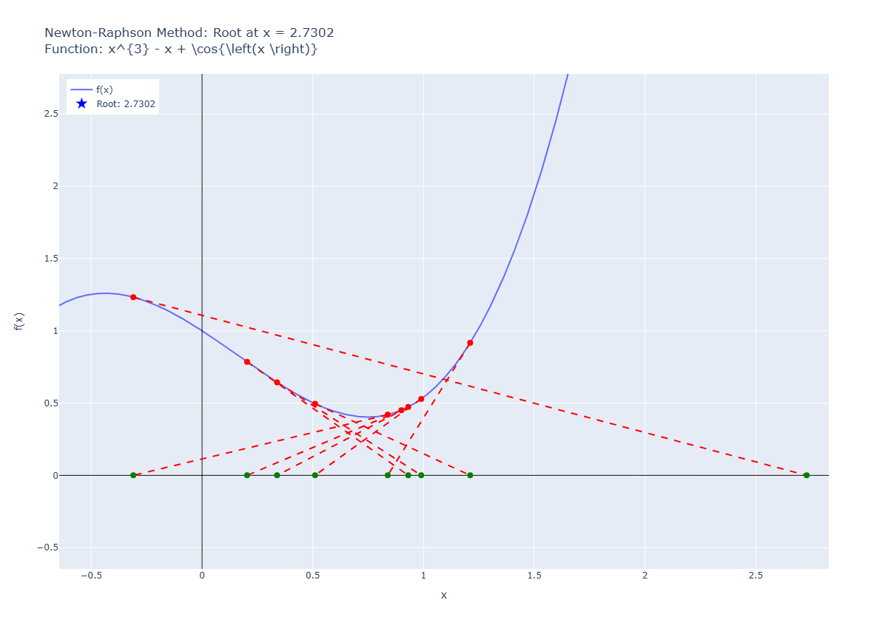

# Pitfall 05: Max and Min Points

## input:

```python
runNRM(
    f = "cos(x) + x**3 - x",
    x0 = 0.9,
    know_root=2.0945514815423265,  # Known root for the function x^3 - 2x - 5
    tol=1e-6,
    max_iter=10
)
```

result:

```plaintext
✗ Não convergiu. Iterações realizadas: 10
Erro: Número máximo de iterações atingido.
Último valor calculado: 2.7302
Iteração 1: x = 0.90000000000000002, f(x) = 0.45060996827066446
Iteração 2: x = 0.20318738327105890, f(x) = 0.78462959591676906
Iteração 3: x = 0.93108680836493152, f(x) = 0.47305585213356149
Iteração 4: x = 0.33865524784873213, f(x) = 0.64338650465768399
Iteração 5: x = 0.98975277280548202, f(x) = 0.52871601875798535
Iteração 6: x = 0.51038365868141022, f(x) = 0.49512408543110442
Iteração 7: x = 1.21066335888968579, f(x) = 0.91621158441747408
Iteração 8: x = 0.83841140043105933, f(x) = 0.41958113044930967
Iteração 9: x = -0.31043606990472872, f(x) = 1.23271962647527022
Iteração 10: x = 2.73020451984058488, f(x) = 16.70421900417551697

Erros Absolutos:
Iteração 1: Erro = 1.19455148154232660
Iteração 2: Erro = 1.89136409827126761
Iteração 3: Erro = 1.16346467317739499
Iteração 4: Erro = 1.75589623369359438
Iteração 5: Erro = 1.10479870873684449
Iteração 6: Erro = 1.58416782286091617
Iteração 7: Erro = 0.88388812265264072
Iteração 8: Erro = 1.25614008111126729
Iteração 9: Erro = 2.40498755144705534
Iteração 10: Erro = 0.63565303829825837
```


## graph:
