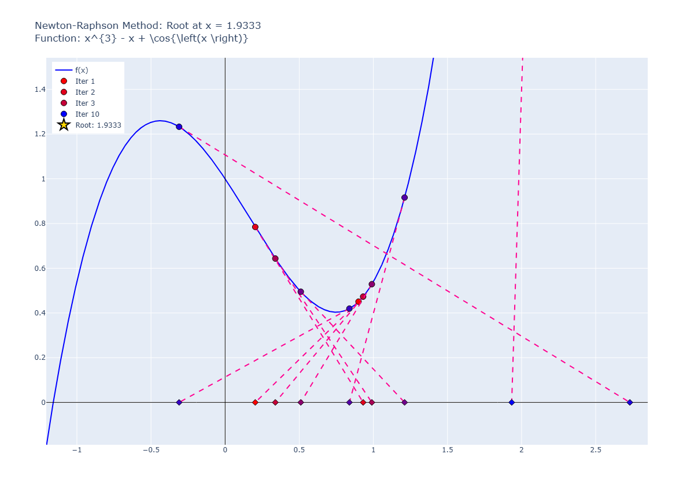

# Pitfall 05: Max and Min Points

## input

```python
runNRM(
    f = "cos(x) + x**3 - x",
    x0 = 0.9,
    know_root=2.0945514815423265,
    tol=1e-6,
    max_iter=10,
    plotError=True,
)
```

result:

```plaintext
✗ Não convergiu. Iterações realizadas: 10
Erro: Número máximo de iterações atingido.
Último valor calculado: 1.9333
Iteração 1: x = 0.90000000000000002, f(x) = 0.45060996827066446
Iteração 2: x = 0.20318738327105890, f(x) = 0.78462959591676906
Iteração 3: x = 0.93108680836493152, f(x) = 0.47305585213356149
Iteração 4: x = 0.33865524784873213, f(x) = 0.64338650465768399
Iteração 5: x = 0.98975277280548202, f(x) = 0.52871601875798535
Iteração 6: x = 0.51038365868141022, f(x) = 0.49512408543110442
Iteração 7: x = 1.21066335888968579, f(x) = 0.91621158441747408
Iteração 8: x = 0.83841140043105933, f(x) = 0.41958113044930967
Iteração 9: x = -0.31043606990472872, f(x) = 1.23271962647527022
Iteração 10: x = 2.73020451984058488, f(x) = 16.70421900417551697
Iteração 11: x = 1.93332993606072678, f(x) = 4.93835804267838796

Erros Absolutos:
Iteração 1: Erro = 2.05960580450169983
Iteração 2: Erro = 1.36279318777275882
Iteração 3: Erro = 2.09069261286663144
Iteração 4: Erro = 1.49826105235043205
Iteração 5: Erro = 2.14935857730718194
Iteração 6: Erro = 1.66998946318311026
Iteração 7: Erro = 2.37026916339138571
Iteração 8: Erro = 1.99801720493275914
Iteração 9: Erro = 0.84916973459697120
Iteração 10: Erro = 3.88981032434228480
Iteração 11: Erro = 3.09293574056242671
```

## graph




## observations

The Newton-Raphson method can struggle with functions that have local maxima or minima, as it may lead to oscillations or divergence. In this case, the function has a local minimum near the initial guess, causing the method to fail to converge to the root. Adjusting the initial guess or using a different method may be necessary for better results.
