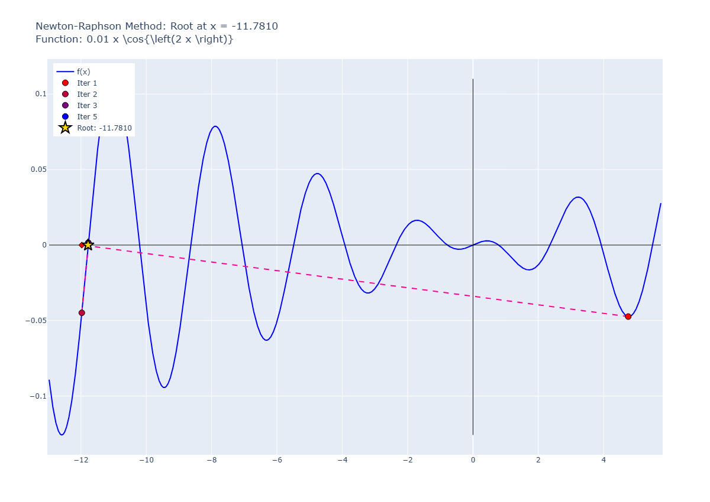

# Pitfall 05: Max and Min Points

## input

```python
runNRM(
    f="x* (cos(2*x)) * 0.01",
    x0=4.75,
    know_root=None,
    tol=1e-6,
    max_iter=100
)
```

result:

```plaintext
✓ Convergiu! Quantidade De Iterações: 5, Raiz: -11.7810
Iteração 1: x = 4.75000000000000000, f(x) = -0.04736567741932798
Iteração 2: x = -11.97301255116330410, f(x) = -0.04486365737362013
Iteração 3: x = -11.77429070649470333, f(x) = 0.00157340920400228
Iteração 4: x = -11.78097664313937010, f(x) = -0.00000098775893849
Iteração 5: x = -11.78097245096321544, f(x) = -0.00000000000035126
Iteração 6: x = -11.78097245096172507, f(x) = -0.00000000000000010
```

## graph



## observations

When an iteration has a slope near zero, the Newton-Raphson method can struggle with convergence, as the derivative becomes very small, leading to large jumps in the next iteration. This can cause oscillations or divergence. In this case, the method converged after a few iterations, but it is important to be cautious with such cases. Adjusting the initial guess or using a different method may be necessary for better results.
