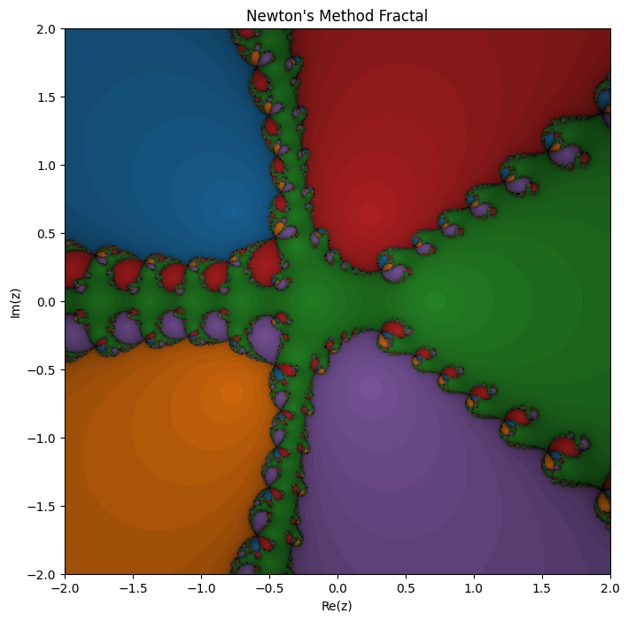

# Fractal: Polinomio 1

## input

```python
f = lambda z: 3*z**5 + z**4 - z**2 + z - 1
df = lambda z: 15*z**4 + 4*z**3 - 2*z + 1
coefs = [3,1, 0, -1, 1, -1] 
roots = np.roots(coefs)
newton_fractal_plot(f=f, df = df,roots=roots, resolution=500, axiss=False)
```

## graph


### observations

