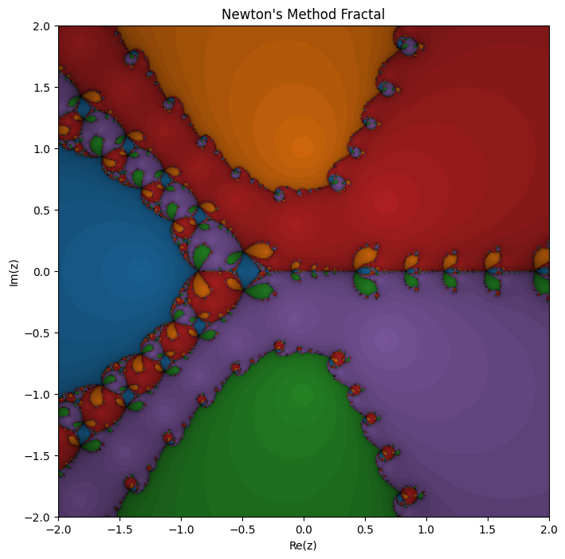

# Fractal: Polinomio 2

## input

```python
f = lambda z: z**5 + z**2 - z + 1
df = lambda z: 5*z**4 + 2*z - 1
coefs = [1, 0, 0, 1, -1, 1]
roots = np.roots(coefs)
newton_fractal_plot(f=f, df=df, roots=roots, resolution=500, axiss=False)
```

## graph


### observations

