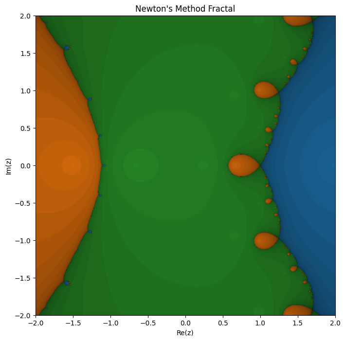

# Fractal: Polinomio 3

## input

```python
f = lambda z: (z-2) * (2*z+3) * (3*z+2)
df = lambda z: 2 * (-10 + z + 9*z **2)
roots = [2,-3/2, -2/3]
newton_fractal_plot(f=f, df=df, roots=roots, resolution=500, axiss=False)
```

## graph


### observations

