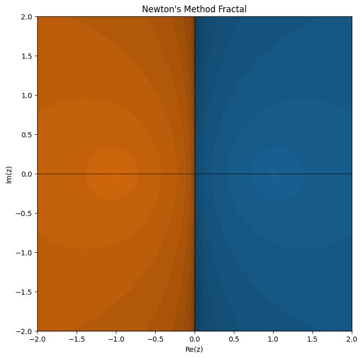
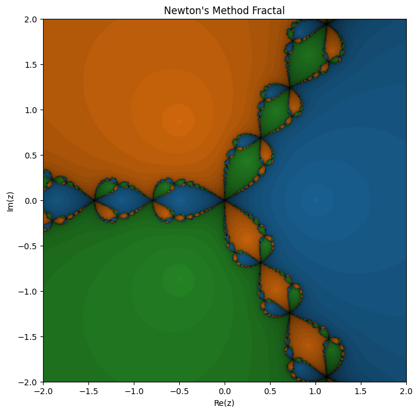
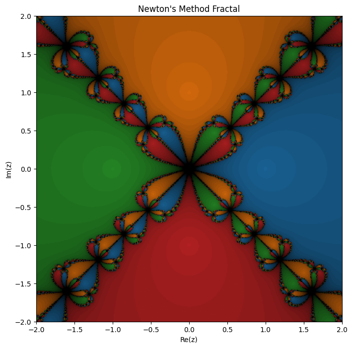
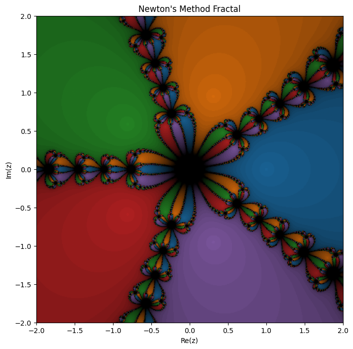
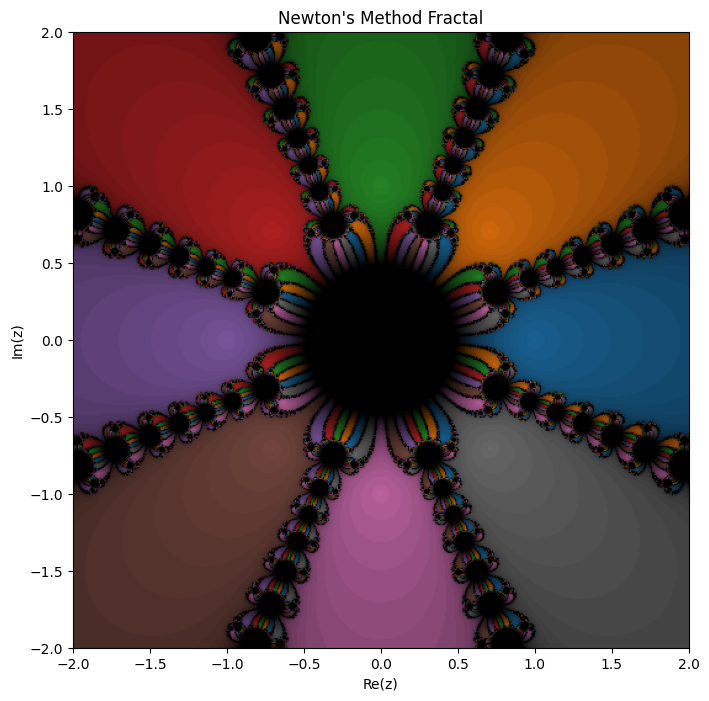
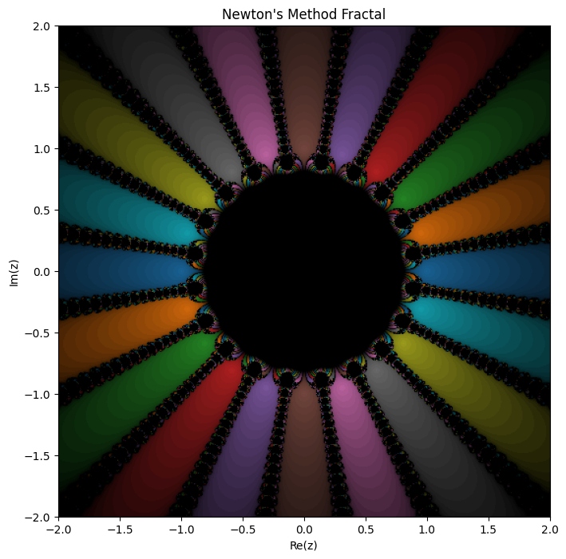

# Fractal: 2 Unit Root's

## input

```python
n = number_of_roots
f = lambda z: z**n - 1
df = lambda z: n*z**(n-1)
roots = np.array([np.exp(2j * np.pi * k / n) for k in range(n)]) 
newton_fractal_plot(f=f, df = df,roots=roots, resolution=500, axiss=False, tol=1e-6 )
```

## graphs

### n = 2



### n = 3



### n = 4



### n = 5



### n = 8



### n = 20


### observations

